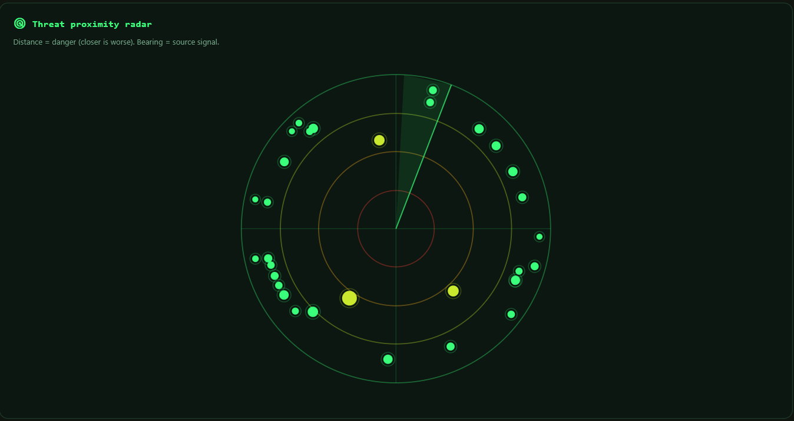
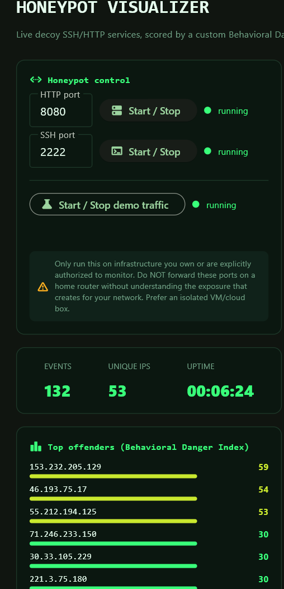
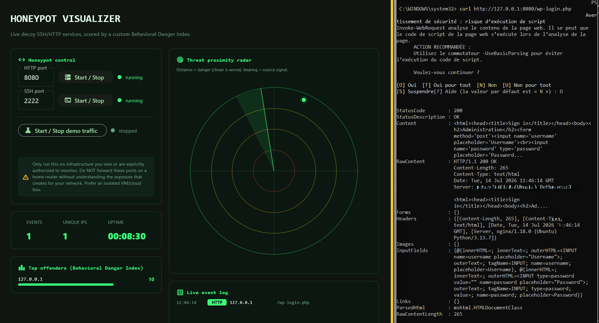

# Honeypot Visualizer

**Decoy SSH/HTTP services, scored by a custom Behavioral Danger Index, displayed on a live threat-proximity radar.**
[](https://opensource.org/licenses/MIT)
[](https://www.python.org/)
Most honeypot dashboards limit their visualization to plotting raw attacker geo-IPs on a standard map and incrementing basic hit counters. This project departs from that convention by introducing two distinct, operationally-focused mechanisms:
1. **The Behavioral Danger Index (BDI):** A proprietary, real-time scoring algorithm combining four independent threat signals (request frequency, path/service diversity, known attack signature matching, and credential-stuffing behavior) into a single, normalized score ranging from 0 to 100 per source IP. Since there is no "official" industry formula for this metric, it is implemented as an original heuristic designed to measure an attacker's persistent intent (refer to `app/intel/scoring.py`).
2. **Threat-Proximity Radar Canvas:** A tactical, military-radar-style interface where the distance from the center encodes the *danger level* (BDI) rather than geographic coordinates. Two separate attackers located on opposite sides of the globe with identical BDI scores will sit on the same concentric danger ring. The angular bearing of each node is determined deterministically via an IP hashing algorithm (or optionally via real-time geolocation), mapping incoming logs to a dedicated, operationally structured dashboard.

---

### System Interface Preview
<p align="center">
  
  <br>
  <em>Figure 1: Full operational dashboard containing the real-time radar, session statistics, local controls, and active event log stream.</em>
</p>

---

## Technical Architecture & Core Components

| Component | Architecture & Technical Function |
| :--- | :--- |
| **HTTP Honeypot** | A lightweight decoy web server configured to intercept, log, and parse common exploitation patterns (such as access attempts on `/wp-login.php`, `/.env`, `/phpmyadmin/`, or `/xmlrpc.php`). The socket handles connections without executing any incoming payload, maintaining complete runtime isolation. |
| **SSH Honeypot** | A low-interaction SSH daemon constructed using the `Paramiko` library. It completes the network handshake, logs authentication attempts (usernames, passwords, and public keys), and **always rejects access**. No active shell or system interaction is ever exposed to the client. |
| **BDI Engine** | A stateful analysis engine that maintains in-memory scoring tables. It re-evaluates and updates an IP's threat index dynamically as new raw events are processed by the system. |
| **Threat Radar UI** | An interactive canvas mapping engine built with custom trigonometry on a 2D viewport, featuring custom sweep sweeps, multi-tiered danger rings, and decaying visual blips based on signal age. |
| **Attack Simulator** | A multi-threaded traffic generator capable of executing synthetic, pre-configured attack sequences. It allows developers to test UI performance and showcase system behavior without exposing network ports. |

<p align="center">
  
  <br>
  <em>Figure 2: Close-up of the Threat Proximity Radar showing active attacker nodes classified by operational risk levels.</em>
</p>

---

## ⚠️ Security & Operational Guidelines
- Run the active socket listeners only on infrastructure **you own or are explicitly authorized to analyze**.
- **Do not** configure port forwarding from your domestic router directly to this application. Exposing these listeners directly to the open internet on a home network carries inherent risks. Use an isolated Virtual Machine (VM) or a dedicated cloud instance (VPS) for real-world testing.
- The SSH honeypot daemon is architecturally incapable of granting an active session. This structural boundary is strictly verified under `tests/test_honeypot_core.py`.
- For safe, instant evaluation of the interface mechanics, use the integrated **"Start demo traffic"** button.

---

## Getting Started
### Prerequisites & Installation
Clone the repository and prepare your Python environment:
```bash
git clone [https://github.com/](https://github.com/)<your-username>/honeypot-visualizer.git
cd honeypot-visualizer
python -m venv .venv
source .venv/bin/activate      # On Windows: .venv\Scripts\activate
pip install -r requirements.txt
python main.py
```
### Running the Application
 1. **Simulation Mode:** Launch the application and click **"Start / Stop demo traffic"** to safely populate the radar canvas with realistic traffic patterns.
 2. **Interactive Live Mode:** Configure the desired local port and toggle **Start / Stop** next to the HTTP or SSH services. You can then trigger the decoy listeners locally from another terminal session.
## Technical Project Structure
```
honeypot-visualizer/
├── main.py
├── requirements.txt
├── app/
│   ├── theme.py
│   ├── capture/
│   │   ├── http_honeypot.py     # Decoy HTTP server implementation
│   │   ├── ssh_honeypot.py      # Decoy SSH daemon (Paramiko)
│   │   ├── event_bus.py         # Thread-safe queue interface for UI synchronization
│   │   └── event_store.py       # SQLite persistence layer for analytical historical data
│   ├── intel/
│   │   ├── signatures.py        # Static database of known attack payloads
│   │   ├── scoring.py           # Behavioral Danger Index heuristic scoring logic
│   │   └── geolocate.py         # IP network mapping utilities
│   ├── simulate/
│   │   └── attack_simulator.py  # Safe multi-threaded simulation traffic engine
│   └── views/
│       ├── radar_canvas.py      # Mathematical model for visual coordinate mapping
│       └── dashboard_view.py    # Main UI application view
└── tests/
    └── test_honeypot_core.py    # Multi-threaded end-to-end socket testing suite
```
## Interactive Local Testing
To evaluate the honeypot defenses locally against your own machine, execute the main script, navigate to the Control Panel, and configure the HTTP socket to port 8080 before starting the listener.
```bash
# From an independent terminal session, execute target HTTP queries:
curl [http://127.0.0.1:8080/wp-login.php](http://127.0.0.1:8080/wp-login.php)
curl [http://127.0.0.1:8080/.env](http://127.0.0.1:8080/.env)
# To test the SSH listener (configured on port 2222):
ssh root@127.0.0.1 -p 2222
```
<p align="center">

<br><em>Figure 3: Side-by-side demonstration of an active socket attack payload triggering instant classification on the central console.</em>
</p>

## Technical Deep Dives & Related Work
### Detailed Write-ups & Community Discussion
For an in-depth breakdown of the mathematical models behind the Behavioral Danger Index (BDI), the thread synchronization logic, and further engineering discussions, check out my active technical publications:
 * **Read the complete technical breakdown on Dev.to**   Focuses on the architectural design patterns, Python concurrency models, and Paramiko integration.
 * **Join the discussion on Reddit**   Community thread detailing real-world deployment observations and threat detection parameters.
 * **View the launching post on LinkedIn**   High-level project summary, live demo video, and industrial use-cases.
### Explore the Security Suite
This project is part of an ongoing series dedicated to demystifying low-level system engineering and computer security principles.
 * **Cipher-Forge (GitHub Repository)**   An interactive visualization platform designed to deconstruct cryptographic operations (AES-128, ECC) from scratch.
 * **Cipher-Forge Launch Discussion on LinkedIn**   Contextual analysis on why interactive, hands-on environments are essential to completing the loop of traditional academic learning.
